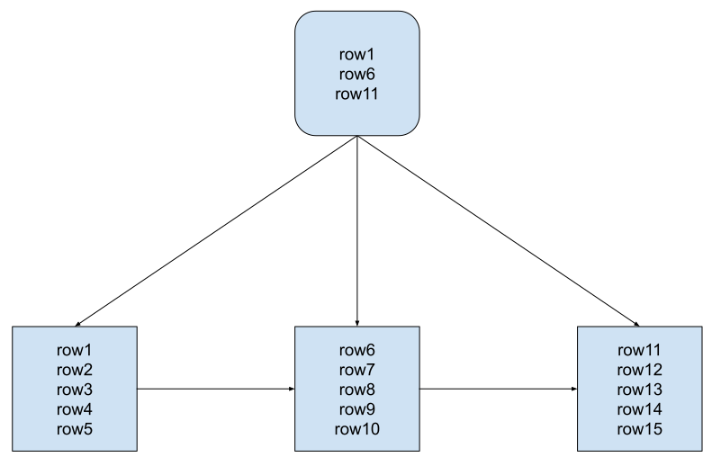

# Cpot

A simple, single-process, zero-dependency inverted index that works for 10 million documents.

Running tests requires googletest.

## SkipTree

This implementation uses a (non-random) SkipTree.

The main differences between this and a (more typical) BTree implementation are:

1. Tree leaves point to their sibling leaves
2. A small fraction of rows are duplicated (i.e. additional memory/disk overhead)

The additional disk/memory overhead is 1 / (b - 1), where b is the branching factor. If your branching factor is sensible (e.g. 20) then the overhead is quite small (5.3%). The benefit of this duplication is that, once you've found the first leaf, you can iterate all the way to the end of the index without looking at any interior nodes. This reduces disk reads and simplifies code.

